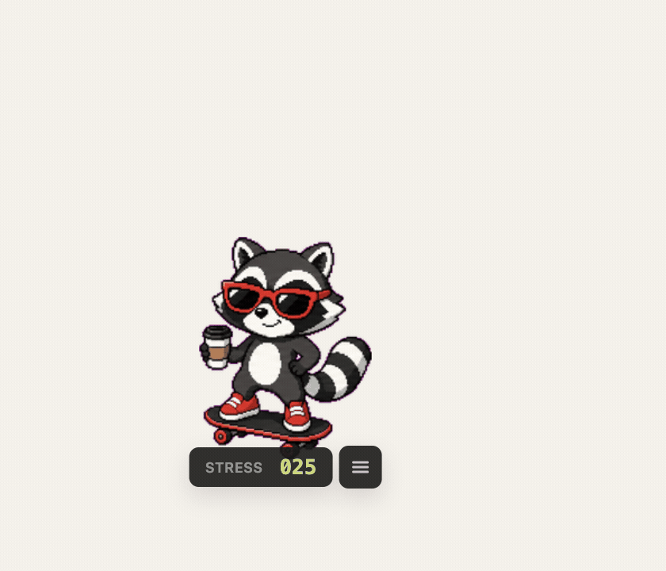
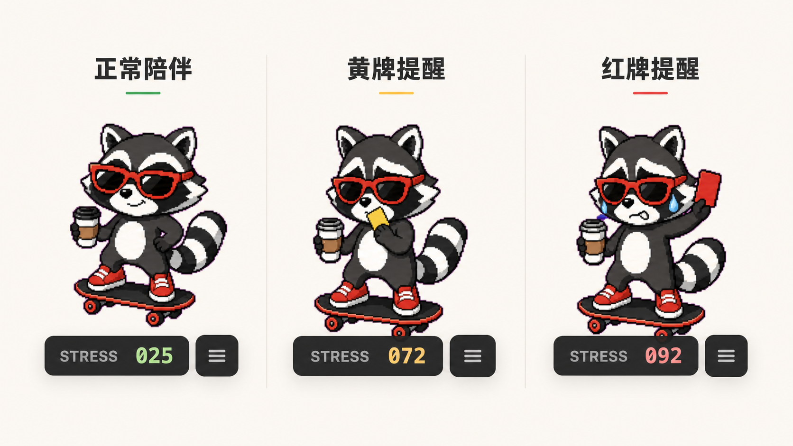
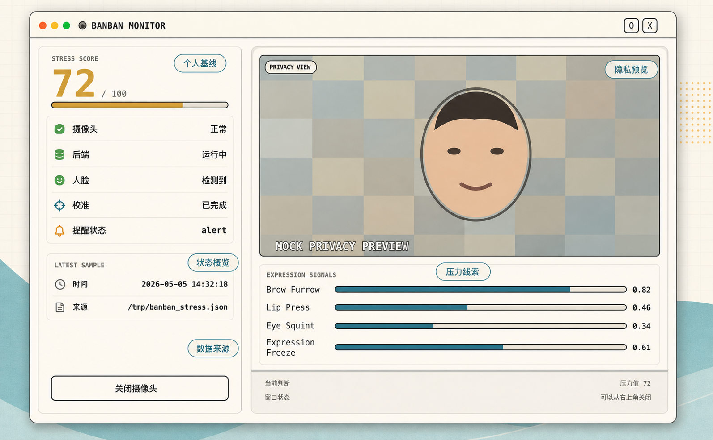
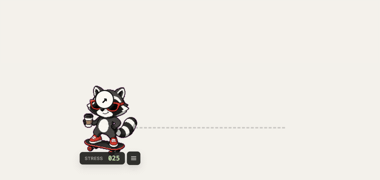

<div align="center">

# 🦝 BanBan / 斑斑

**过载前，先停一下。**

一只本地运行的压力觉察桌宠，帮助心智障碍就业者在情绪崩溃前收到温和提醒。

<p>
  
  
  
  
</p>



</div>

---

## 这是什么

BanBan 是一只桌面宠物。它安静地陪伴在你的屏幕角落，通过本地摄像头观察皱眉、眯眼、嘴唇紧绷、表情冻结等面部压力线索。当压力持续升高时，它会像足球裁判一样举起黄牌或红牌，弹出气泡提醒你：先停一下，喝口水，捋一捋思路。

<div align="center">

</div>

## 为什么做这个

很多心智障碍就业者并非不能胜任工作，而是在岗位上压力不断积累时，自己意识不到已经接近临界点——直到"突然崩溃"，然后被辞退。他们需要有人在旁边及时提醒，但专业就业支持员资源稀缺，不可能时时刻刻陪在身边。

BanBan 不做医疗诊断，也不替代专业就业支持员。它尝试提供一种轻量、私密、低打扰的辅助提醒方式——一个赛博就业支持员。

## 项目亮点

- **压力线索识别，不是情绪贴标签** — 关注微表情压力信号，做压力状态估计，不判断"真实情绪"
- **个人平静基线校准** — 启动时建立使用者自己的平静基线，根据相对变化计算压力，减少误判
- **桌宠式温和提醒** — 黄牌/红牌 + 气泡提醒替代生硬弹窗，让提醒更像陪伴
- **默认本地处理** — 人脸分析在本机完成，不使用云端 API
- **隐私预览** — Monitor 面板使用马赛克背景 + 主要人脸区域，减少办公场景隐私暴露
- **关掉摄像头，它仍然是一只桌宠** — 可拖动、可点击、陪你工作

<div align="center">

</div>

## 架构

```text
摄像头
  ↓
backend/emotion_watch.py
  - OpenCV 读取摄像头
  - MediaPipe FaceLandmarker 提取 blendshapes
  - 计算压力分数和四类压力线索
  - 写入 /tmp/banban_stress.json
  - 写入 /tmp/banban_preview.jpg
  ↓
electron/main.js
  - 启动/停止 Python 后端
  - 每 3 秒轮询压力 JSON
  - 维护 idle / alert / cooldown 提醒状态机
  - 创建透明置顶桌宠窗口和 Monitor 窗口
  ↓
frontend/pet-widget.html
  - Canvas 渲染桌宠 spritesheet
  - 根据压力、摄像头状态、校准状态切换动画和 UI
  - 支持拖拽、点击、气泡、设置菜单
  ↓
frontend/monitor.html
  - 展示压力分数、四类信号、校准状态和隐私预览
```

## 快速启动

**环境要求：** macOS / Node.js / Python 3 / 摄像头权限

```bash
# 克隆仓库
git clone https://github.com/YUHAO-corn/banban-desktop-pet.git
cd banban-desktop-pet

# 安装 Python 依赖
python3 -m pip install -r requirements.txt

# 安装 Electron 依赖并启动
cd electron
npm install
npm start
```

`npm start` 会自动拉起 Python 后端，无需手动启动。首次运行时 macOS 会询问摄像头权限，请允许。

<div align="center">

</div>

## 目录结构

```text
banban-desktop-pet/
├── assets/
│   ├── images/          # README 配图
│   └── pets/banban/     # 桌宠 spritesheet 和配置
├── backend/
│   ├── emotion_watch.py
│   ├── face_landmarker_v2_with_blendshapes.task
│   └── capture.sh
├── electron/
│   ├── main.js
│   ├── preload.js
│   └── package.json
├── frontend/
│   ├── pet-widget.html
│   ├── monitor.html
│   ├── pet-widget-spec.md
│   └── integration-guide.md
├── PRD.md
├── README.md
└── requirements.txt
```

## 隐私说明

BanBan 的设计原则是站在使用者一侧，帮助使用者自己觉察状态，而不是向雇主或他人暴露状态。

- 人脸分析在本机完成，未使用云端识别 API
- 不会上传摄像头画面
- 压力分数通过本地临时文件 `/tmp/banban_stress.json` 通信
- Monitor 预览图为马赛克背景 + 主要人脸区域
- 关闭摄像头或退出应用时，自动清理临时文件

## 注意事项

- BanBan 不是医疗诊断工具，不能替代医生、心理咨询师或专业就业支持员
- 当前是 macOS 原型，尚未适配 Windows / Linux
- 项目依赖 `backend/face_landmarker_v2_with_blendshapes.task`，请不要删除该模型文件
- 如果摄像头选错，可以使用 `BANBAN_CAMERA_INDEX` 或 `BANBAN_CAMERA_ORDER` 环境变量指定

## 开发状态

这个项目是 TRAE SOLO 挑战赛公益赛道（Hello AI 科技致善）原型。已完成从本地压力线索识别、桌宠提醒到 Monitor 面板的基本闭环，仍有可以继续打磨的方向：

- 更细分的提醒话术
- 面向不同岗位场景的提醒策略
- 自我记录和状态回看
- 和真实就业支持者、公益机构、当事人继续交流验证

## 致谢

- [TRAE SOLO](https://www.trae.cn/) — 项目构思、实现和迭代过程中的共创伙伴
- [MediaPipe Face Landmarker](https://ai.google.dev/edge/mediapipe/solutions/vision/face_landmarker) — 本地人脸关键点和 blendshape 信号能力
- OpenCV、Electron，以及所有让桌面小工具能快速跑起来的开源项目

---

<div align="center">

**如果这个项目对你有启发，欢迎 Star ⭐ 或提 Issue 交流**

</div>
